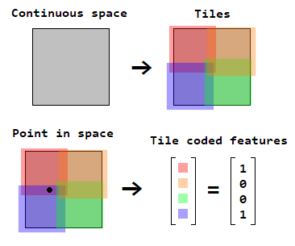
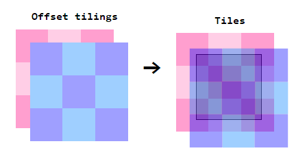
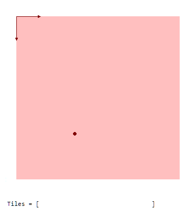
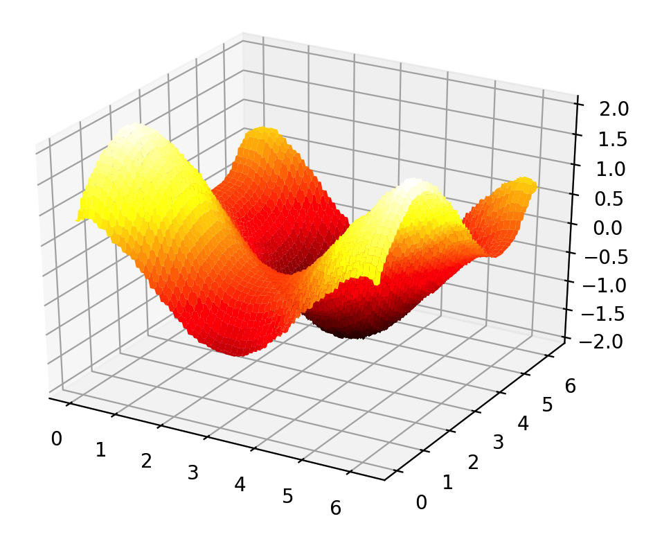

# Tile Coding

[Tile coding](http://incompleteideas.net/book/ebook/node88.html#SECTION04232000000000000000) is a coarse coding method which uses several offsetted tilings to produce binary feature vectors for points in a continuous space.

At a high level, tile coding is used to convert a point in an n-dimensional space into a binary feature vector such that the vectors of nearby points have many elements in common, and vice versa with distant points. It works by covering a continuous space with *tiles*, where each tile has a corresponding index in a vector. The tiles can be any arbitrary shape, but are typically n-dimensional hyperrectangles for computational convenience. The binary feature vector for a point in the space would have a ```1``` at the indices of the tiles intersected by the point, and a ```0``` everywhere else:

<p align="center">
  
</p>

Tile coding lays tiles over the continuous space through the use of ```tilings```. A tiling can be thought of as an n-dimensional grid of tiles with potentially different scales of values along each dimension. Several offsetted tilings are then placed over the space to create regions of overlapping tiles. A useful property of laying tiles this way is that the number of tiles intersected will always be the number of tilings used, as a point can't intersect two tiles within the same tiling:

<p align="center">
  
</p>


# Dependencies

* numpy

# Usage

A tile coder is instantiated with the following arguments:

* A list of the number of tiles spanning each dimension
* A list of tuples containing the value limits of each dimension
* The number of tilings
* (Optional) A function returning a list of tiling offsets along each dimension, given the number of dimensions
  * Default: Consecutive odd numbers (Miller & Glanz, 1996)

Once instantiated, it uses ```__getitem__()``` to take a coordinate of a continuous space and return a numpy array with the indices of the active tiles. That is, it implicitly produces a binary vector of active tiles by returning the locations of the vector which have a ```1```. The instance's ```n_tiles``` property will give the total number of tiles across all of the tilings, which corresponds to the tile-coded binary feature vector's length.

## A Simple Example

Suppose we want to tile a continuous 2-dimensional space where the values of each dimension range from ```0``` to ```10```. For this example, we'll have tilings which consist of ```10``` tiles spanning the complete range of values for each dimension (A ```10×10``` tiling), and use ```8``` tilings (with the default tiling offsets).

First, we import the tile coder:

```python
from tilecoding import TileCoder
```

Next, we specify the number of tiles spanning each dimension (tiling dimensions), the value limits of each dimension, and the number of tilings:

```python
# number of tile spanning each dimension
tiles_per_dim = [10, 10]
# value limits of each dimension
lims = [(0.0, 10.0), (0.0, 10.0)]
# number of tilings
tilings = 8
```

We can now instantiate a tile coder (which we'll denote ```T```):

```python
T = TileCoder(tiles_per_dim, lims, tilings)
```

The tile coder can then return the active tiles for given ```(x, y)``` coordinates in this 2-dimensional space via ```T[x, y]```:

```bash
# get active tiles for location (3.6, 7.21)
>>> T[3.6, 7.21]
array([ 80, 201, 322, 443, 565, 697, 807, 928])

# a nearby point, differs from (3.6, 7.21) by 1 tile
>>> T[3.7, 7.21]
array([ 80, 201, 322, 444, 565, 697, 807, 928])

# a slightly farther point, differs from (3.6, 7.21) by 5 tiles
>>> T[4.1, 7.10]
array([ 81, 202, 323, 444, 565, 686, 807, 928])

# a much farther point, no tiles in common with (3.6, 7.21)
>>> T[6.6, 9.14]
array([105, 226, 347, 468, 590, 722, 832, 953])
```

Below is a visualization of how the active tiles of the ```8``` tilings are computed for location ```(3.6, 7.21)```:

<p align="center">
  
</p>

## Function Approximation Example

Suppose we want to approximate a continuous 2-dimensional function with a function that's linear in a tile-coded vector of binary features. Let's approximate ```f(x, y) = sin(x) + cos(y)``` where the values of both ```x``` and ```y``` range from ```0``` to ```2π```, and we only have access to *noisy*, *online* samples of the function (within the specified range).

We'll use a tile coder with ```8``` tilings, each consisting of ```8``` tiles spanning the range of values in each direction (An ```8×8``` tiling):

```python
import numpy as np
from tilecoding import TileCoder

# tile coder tiling dimensions, value limits, number of tilings
tiles_per_dim = [8, 8]
lims = [(0.0, 2.0 * np.pi), (0.0, 2.0 * np.pi)]
tilings = 8

# create tile coder
T = TileCoder(tiles_per_dim, lims, tilings)
```

The following function will produce a noisy sample from our target function:

```python
# target function with gaussian noise
def target_fn(x, y):
  return np.sin(x) + np.cos(y) + 0.1 * np.random.randn()
```

Our approximate (linear) function can be represented with a set of weights, one for each tile in the tile coder's tilings. The function's output can then be computed as a dot product between this weight vector and the tile-coded feature vector for a given coordinate. We can get the total number of tiles across all of the tile coder's tilings (the feature vector length) using ```T.n_tiles```:

```python
# linear function weight vector
w = np.zeros(T.n_tiles)
```

We'll then take 10,000 online samples (i.e., we don't store them and only work with the most recent sample) at random locations of the target function. We can update our weights using [stochastic gradient descent](https://en.wikipedia.org/wiki/Stochastic_gradient_descent) (SGD) in the *mean squared error* between the samples and our linear function's estimates. Note that because we're using a *binary representation*, we can evaluate our linear function using the indices of the active tiles with ```w[active_tiles].sum()```, as opposed to computing a dot product between our weight vector and an explicit binary feature vector.

```python
# step size for SGD
alpha = 0.1 / tilings

# learn from 10,000 samples
for i in range(10000):
   # get noisy sample from target function at random location
  x, y = 2.0 * np.pi * np.random.rand(2)
  target = target_fn(x, y)
  # get prediction from active tiles at that location
  tiles = T[x, y]
  pred = w[tiles].sum()
  # update weights with SGD
  w[tiles] += alpha * (target - pred)
```

We can check how good our learned approximation is by evaluating our approximate function against the true target function at various points:

```bash
# check approximate value at (2.5, 3.1)
>>> tiles = T[2.5, 3.1]
>>> w[tiles].sum()
-0.40287006579746704
# compare to true value at (2.5, 3.1)
>>> np.sin(2.5) + np.cos(3.1)
-0.40066300616932304
```

Alternatively, we can plot a surface of our learned approximation (e.g., with matplotlib):

```python
import matplotlib.pyplot as plt
from mpl_toolkits.mplot3d import Axes3D

# resolution
res = 200

# (x, y) space to evaluate
x = np.arange(0.0, 2.0 * np.pi, 2.0 * np.pi / res)
y = np.arange(0.0, 2.0 * np.pi, 2.0 * np.pi / res)

# map the function across the above space
z = np.zeros([len(x), len(y)])
for i in range(len(x)):
  for j in range(len(y)):
    tiles = T[x[i], y[j]]
    z[i, j] = w[tiles].sum()

# plot function
fig = plt.figure()
ax = fig.gca(projection='3d')
X, Y = np.meshgrid(x, y)
surf = ax.plot_surface(X, Y, z, cmap=plt.get_cmap('hot'))
plt.show()
```

<p align="center">
  
</p>
